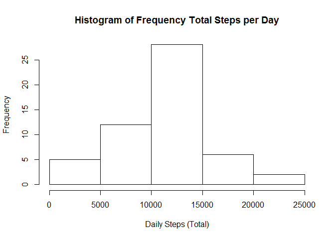
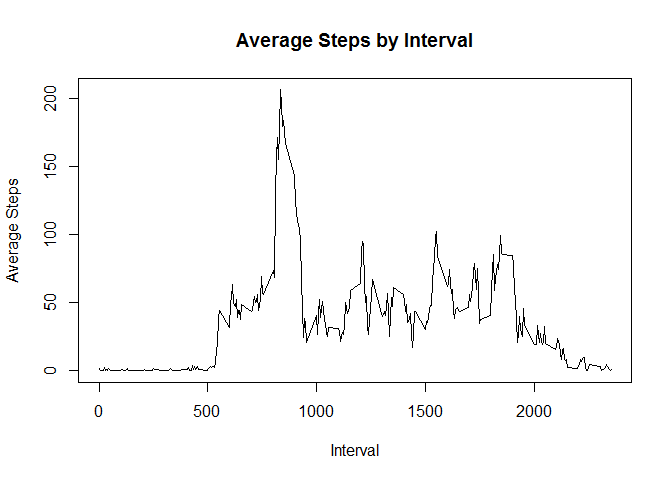
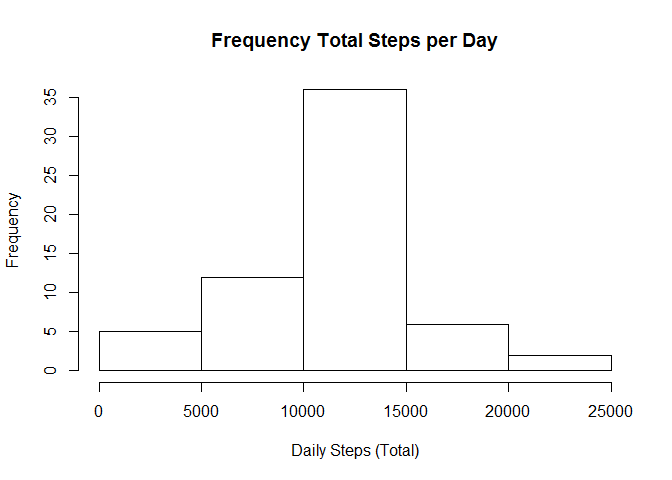
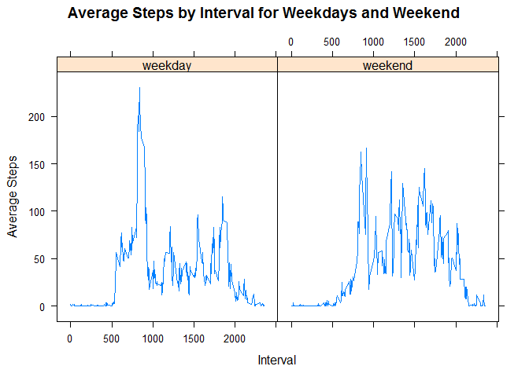

# Reproducible Research: Peer Assessment 1


## Loading and preprocessing the data

```r
setwd("~/R/R_Assign/Reproducible")
## 1. Load data
stepsData <- read.csv("activity.csv", header=TRUE)
## 2. Process/transform the data
stepsData$date <- as.Date(stepsData$date, format = "%Y-%m-%d")
```


## What is mean total number of steps taken per day?

```r
dailyTotSteps <- aggregate(. ~ date, data=stepsData, FUN=sum) ##Calculate total steps
hist(dailyTotSteps$steps, main="Histogram of Frequency Total Steps per Day", xlab="Daily Steps (Total)") ## Histogram total steps
```

 

```r
mean(dailyTotSteps$steps) ## Calculate mean and median steps per day
```

```
## [1] 10766.19
```

```r
median(dailyTotSteps$steps) ## Calculate mean and median steps per day
```

```
## [1] 10765
```


## What is the average daily activity pattern?

```r
meanIntSteps <- aggregate(steps ~ interval, data=stepsData, FUN=mean) ##              Calculate average steps by 5-minute interval (averaged across all days)
plot(meanIntSteps$interval, meanIntSteps$steps, type="l", main="Average Steps by Interval", xlab="Interval",ylab="Average Steps")             ## time series plot, 5-minute interval and average number of steps taken
```

 

```r
meanIntSteps[which.max(meanIntSteps$steps),] ## Report which 5-minute interval contains maximum number of steps
```

```
##     interval    steps
## 104      835 206.1698
```


## Imputing missing values
We'll use the average of the interval to replace the Null values.

```r
sum(is.na(stepsData$steps)) ## Count rows with NAs
```

```
## [1] 2304
```

```r
stepsDataNoNA <- stepsData[,c(1:3)]
stepsDataNoNA$steps <- ifelse(is.na(stepsDataNoNA$steps) & stepsDataNoNA$interval == meanIntSteps$interval, meanIntSteps$steps, stepsDataNoNA$steps) ## fill in missing values with the mean of that interval
dailyTotStepsNoNA <- aggregate(steps ~ date, data=stepsDataNoNA, FUN=sum) ##       Calculate total steps
hist(dailyTotStepsNoNA$steps, main="Frequency Total Steps per Day",xlab="Daily Steps (Total)") ## Histogram total steps
```

 

```r
mean(dailyTotStepsNoNA$steps) ## Calculate mean and median steps per day
```

```
## [1] 10766.19
```

```r
median(dailyTotStepsNoNA$steps) ## Calculate mean and median steps per day
```

```
## [1] 10766.19
```
You can see that the average hasn't changed.  This is because we replaced Nulls with the average value for that interval, so we're keeping values at the average.
However, the median has moved up to the average because we have more values at the mean now.

## Are there differences in activity patterns between weekdays and weekends?

```r
stepsDataNoNA$weekday <- weekdays(stepsDataNoNA$date)
stepsDataNoNA$weekdayEnd <- ifelse(stepsDataNoNA$weekday == "Saturday"|stepsDataNoNA$weekday == "Sunday", "weekend", "weekday") ## Create factor variable - weekday and weekend
meanIntStepsWeek <- aggregate(steps ~ interval + weekdayEnd, data=stepsDataNoNA, FUN=mean)
library(lattice)
xyplot(meanIntStepsWeek$steps~meanIntStepsWeek$interval|meanIntStepsWeek$weekdayEnd, type = "l", 
  	main="Average Steps by Interval for Weekdays and Weekend", 
   ylab="Average Steps", xlab="Interval")
```

 
